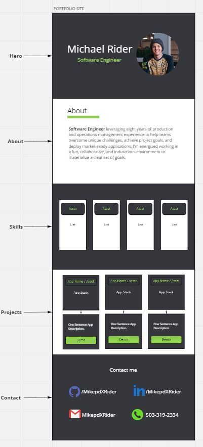

# Portfolio Site

## Description

A site to highlight my favorite software development projects and practice using TypeScript.

## Stack

| Tech            | Use                   |
| --------------- | --------------------- |
| React           | Front-End Library     |
| TypeScript      | Static Typing Stystem |
| Framer Motion   | Animations            |
| Netlify         | Web Hosting           |
| Miro            | Wireframing           |
| GitHub Projects | Progress Tracking     |

## Credits

| Resource                | Author                                                      |
| ----------------------- | ----------------------------------------------------------- |
| Github & LinkedIn Icons | [riajulislam](https://www.flaticon.com/authors/riajulislam) |
| Email Icon              | [Uniconlabs](https://www.flaticon.com/authors/uniconlabs)   |
| Resume/CV Icon          | [TBD]()                                                     |

## Initial Mock

